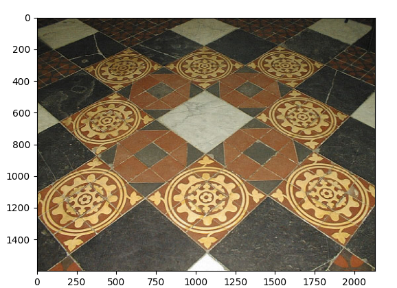
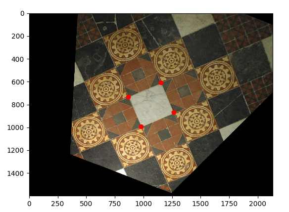
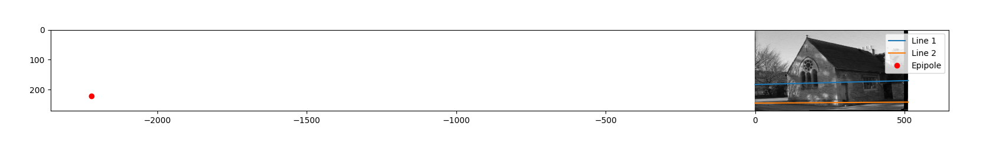
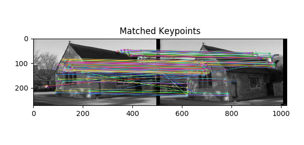

# advanced-visual-geometry
This repository contains lab assignments completed for the Advanced Visual Geometry course as part of my Master's program in Advanced Robotics at Centrale Nantes.

## Overview

The labs in this repository cover topics from the course, including image affine and metric rectification, fundamental matrix estimation, 3D reconstruction, and visual odometry.

## Contents

- `lab_1/` - Unwrapping the image and removing distortions 
- `lab_2/` - Estimation of fundamental matrix and 3D reconstruction 
- `lab_3/` - Visual Odometry Implementation

## Visuals

Below are key visuals from the lab assignments, including plots, diagrams, and screenshots that illustrate the results and methodologies.

## Lab 1
Before on the left and after on the right
<table>
  <tr>
    <td align="center">
      
    </td>
    <td align="center">
      
    </td>
  </tr>
</table>

## Lab 2  
Epipolar lines in the first image, feature correspondence in the second and 3D reconstruction on the third image
<table>
  <tr>
    <td align="center">
      
    </td>
    <td align="center">
      
    </td>
    <td align="center">
      
    </td>
  </tr>
</table>

  
## Lab 3
Computing the camera poses using Visual Odometry (VO)
  

  
  

